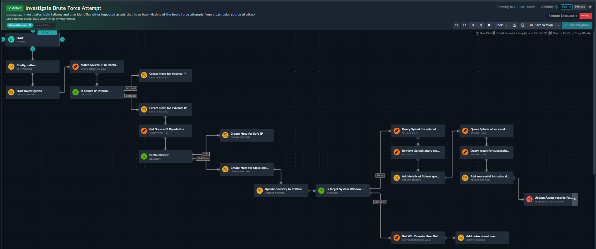
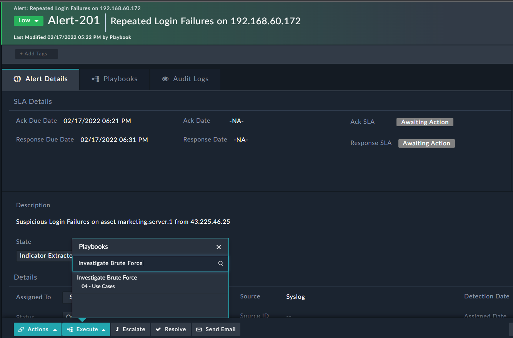
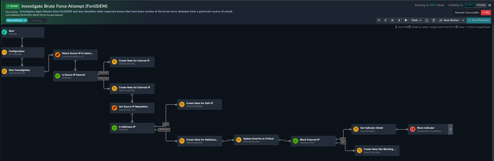

[TOC]

# Overview

The scenario demonstrates the Brute Force Attacks and generates an alert for the Alert Type **Brute Force Attempts** for **Repeated Login Failure**.

In such attacks, the attacker uses trial and error to guess or crack an account password, user login credentials, and encryption keys.

## Version Information

* Solution Pack Version: 1.0.0
* FortiSOAR Version Tested on: 7.2.0
* Authored By: Fortinet
* Certified: Yes

## Pre-requisite

This solution pack needs the following solution packs pre-deployed:

| Solution Pack         | Purpose                                  | Doc Link |
| --------------------- | ---------------------------------------- | -------- |
| SOAR Essentials 1.0.0 | * Required for basic modules such as alerts, incidents, and comments  * Required for action playbooks          |[Click Here](https://github.com/fortinet-fortisoar/solution-pack-incident-response/blob/release/1.0.0/README.md) |
| SOC Simulator 1.0.0 | Required for Scenario module and record | [Click Here](https://github.com/fortinet-fortisoar/solution-pack-soc-simulator/blob/develop/README.md) | 

## Connector List

None

## Playbook Collections

| Playbook Name | Description |
|---------------|-------------|
| Generate > FortiSIEM (Brute Force Attack) | Generates demo alert for the Alert Type 'Brute Force Attempts' for 'Sudden Increase in Failed Logins To A Host' for source 'FortiSIEM' |
| Investigate Brute Force Attempt   | Investigates login failures and also identifies other impacted assets that have been victims of the brute force attempts from a particular source of attack |
| Investigate Brute Force Attempt (FortiSIEM)   | Investigates login failures from FortiSIEM and also identifies other impacted assets that have been victims of the brute force attempts from a particular source of an attack.|

# Use Case Workflow

This solution pack contains two types of execution workflows
* Scenario-based Workflow
* Investigate Brute Force Attack
* Investigate Brute Force Attack (FortiSIEM)

##  Scenario-based Workflow

The scenario demonstrates and generates a demo alert for the Alert Type **Brute Force Attempts**.

The Scenario-based workflow follows the following pattern:
1. Go to the **Simulations** menu in Navigation and choose Device **Brute Force Attempt** and **Brute Force Attempt (FortiSIEM)**.
2. Click on the **Run Scenario** button to create demo records for the scenario.
4. The created Alerts records IRI will be displayed in the Scenario record.

## Investigate Brute Force Attempts

After the scenario workflow generates the demo alert, the use case workflow investigates it through a playbook.

The investigation playbooks follow the following pattern:

1. Manual trigger of the playbook starts the investigation on 'Brute Force Attempt' alert for source 'syslog' and looks for any malicious IOC (Indicator of Compromise) related to the alert.

    

2. If it finds a malicious IOC, it updates the alert severity to critical and checks if the target system is Windows or Linux.
    * Windows:
        * Gets details from Active Directory
    * Linux:
        * Query Splunk for related events for source IP address
        * Create and link affected assets
3. If the IOC found is non-malicious IOC, it marks the IP as safe.

## Investigate Brute Force Attempts(FortiSIEM)

After the scenario workflow generates the demo alert, the use case workflow investigates it through a playbook.

The investigation playbooks follow the following pattern:

1. Manual trigger of the playbook starts the investigation on **Brute Force Attempt**. The alert is **Sudden Increase in Failed Logins To A Host**, and the source is **FortiSIEM**.   
2. It then looks for any malicious IOC related to the alert.
3. If it finds a malicious IOC, it updates the alert's severity to critical and checks for a manual intervention to block the IP address.
    * When it receives instructions to block
        * It gets IOC details
        * It blocks the IOC
    * When it receives instructions to allow
        * It creates a note to allow the IP address
4. If the IP address found is non-malicious, it creates a note marking the IP as safe.